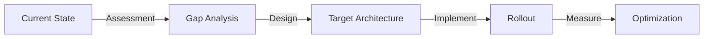
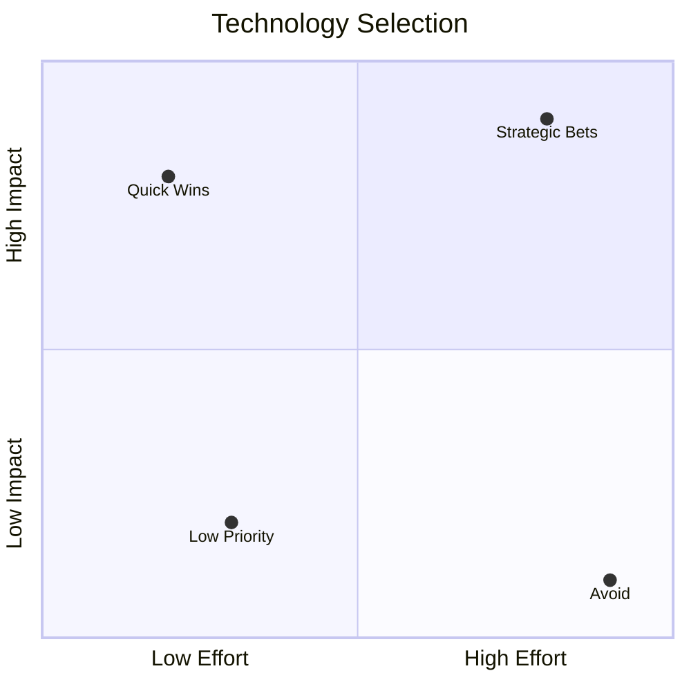
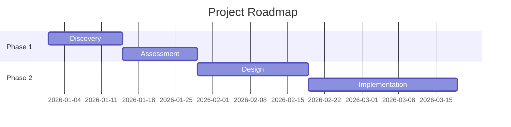
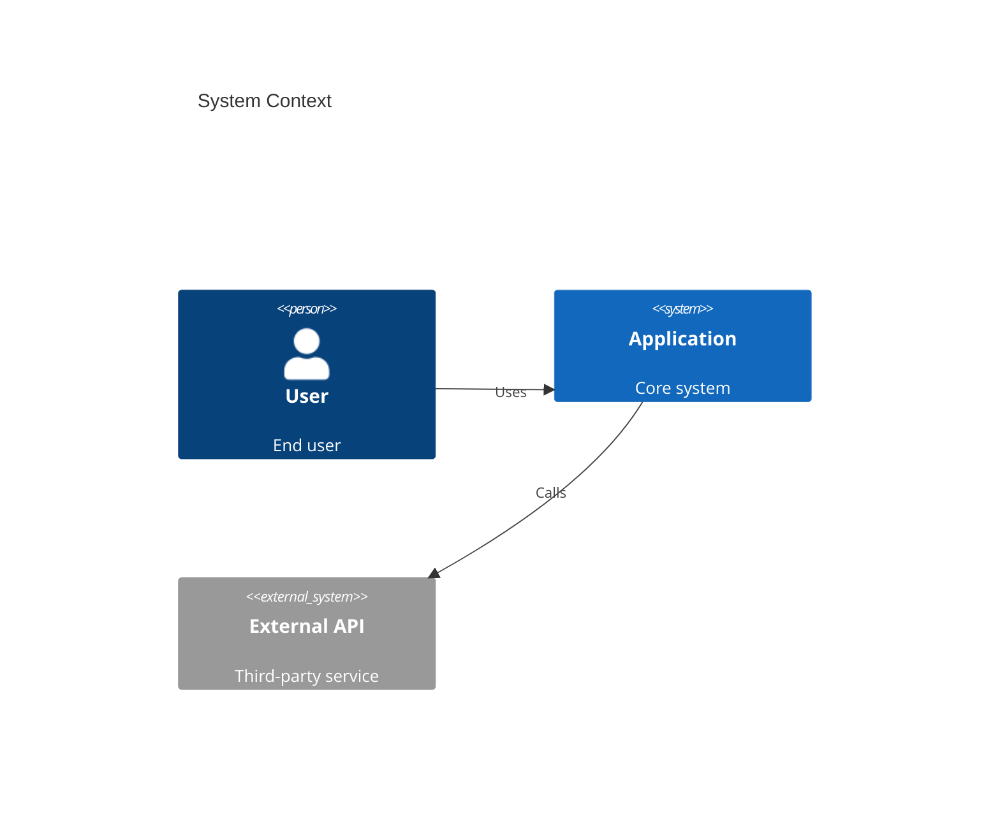

# Creative Productivity -- Consulting Deliverables Pipeline

Turn ideas into polished, client-ready artifacts. This skill bundles the best open-source tools for agentically generating visual and written deliverables -- diagrams, presentations, architecture visuals, and documents.

## When to Use

- Creating *diagrams* (architecture, flow, sequence, ERD, system design)
- Building *presentations* (pitch decks, QBRs, workshop slides, training materials)
- Drafting *documents* (one-pagers, proposals, executive summaries, workshop handouts)
- Producing *visual arguments* that communicate strategy, not just data
- Any task where the deliverable must look professional and be editable

## Tool Selection Guide

Pick the right tool for the job:

| Need | Tool | Output | Best For |
|------|------|--------|----------|
| Visual argument, conceptual diagram | **Excalidraw** | `.excalidraw` + PNG | Architecture overviews, concept maps, strategy visuals |
| Quick flowchart, sequence, ERD | **Mermaid** | `.md` with mermaid blocks | Documentation, README diagrams, inline visuals |
| Editable architecture diagram | **draw.io** | `.drawio` XML + PNG | AWS/cloud architectures, detailed technical docs |
| Slide deck (web, interactive) | **Reveal.js** | Single HTML file | Pitch decks, conferences, interactive presentations |
| Slide deck (markdown, fast) | **Marp** | `.md` → PDF/PPTX/HTML | Internal decks, quick iterations, dev-friendly slides |
| Written deliverable | **Markdown** | `.md` → PDF | Proposals, one-pagers, executive summaries |

**Decision flow:**
1. Is it a diagram? → How complex? Simple inline → *Mermaid*. Visual argument → *Excalidraw*. Detailed architecture → *draw.io*.
2. Is it a presentation? → Interactive/branded → *Reveal.js*. Fast/iterative → *Marp*.
3. Is it a document? → *Markdown* with structured templates.

## Setup (Per Tool)

Each tool has optional dependencies. Install only what you need.

### Excalidraw (Diagrams that argue)
```bash
# Render pipeline (validates output visually)
cd <skill-dir>/references/excalidraw && uv sync && uv run playwright install chromium
```
- Generates `.excalidraw` JSON → rendered to PNG via Playwright
- Brand colors in `references/excalidraw/color-palette.md`
- See `references/excalidraw/guide.md` for full methodology

### Mermaid (Inline diagrams)
```bash
npm install -g @mermaid-js/mermaid-cli  # optional: for PNG/SVG export
```
- Write mermaid blocks directly in Markdown -- most renderers (GitHub, Obsidian, Notion) handle them natively
- For PNG export: `mmdc -i input.md -o output.png`
- See `references/mermaid-patterns.md` for consulting-specific patterns

### Reveal.js (Interactive presentations)
```bash
npm install -g reveal.js  # optional: for local preview
```
- Generates single self-contained HTML files (no build step)
- Themes, Chart.js, Font Awesome built-in
- Speaker notes, animations, PDF export via DeckTape
- See `references/revealjs-guide.md` for templates

### Marp (Markdown slides)
```bash
npm install -g @marp-team/marp-cli  # required for export
```
- Write slides in Markdown with `---` separators
- Export: `marp --pdf deck.md` or `marp --pptx deck.md`
- Themes via CSS, Marp directives for layout
- See `references/marp-guide.md` for patterns

### draw.io (Architecture diagrams)
```bash
# CLI for PNG conversion (optional)
# Install draw.io desktop or use drawio-cli
pip install drawio-batch  # or use the desktop app
```
- Generates `.drawio` XML files (editable in draw.io/diagrams.net)
- AWS/Azure/GCP icon support
- See `references/drawio-guide.md` for XML patterns

## Workflow

### 1. Understand the Brief
Before creating anything:
- **Audience:** Who will see this? (Client exec, dev team, workshop participants)
- **Purpose:** Inform, persuade, teach, or decide?
- **Format:** Where will it be shown? (Screen share, print, embedded in docs, posted in Slack)
- **Brand:** Does the client or company have specific colors/fonts? Check `references/` for palettes.

### 2. Choose the Right Tool
Use the Tool Selection Guide above. When in doubt:
- For *persuasion* → Excalidraw (visual arguments win hearts)
- For *precision* → draw.io or Mermaid (technical accuracy wins minds)
- For *presenting* → Reveal.js or Marp (structured narrative)
- For *reading* → Markdown document (depth and detail)

### 3. Create the Artifact
Follow the tool-specific guide in `references/`. Key principles across all tools:

**Structure First:**
1. Outline the argument or narrative before touching any tool
2. Each section/slide/region should answer ONE question
3. Flow: Context → Problem → Solution → Evidence → Next Steps

**Visual Hierarchy:**
- Most important element = largest / most isolated
- Use color semantically (not decoratively)
- Whitespace signals importance

**Consulting Standard:**
- Every diagram tells a story, not just shows a structure
- Every slide has a "so what?" takeaway
- Every document has an executive summary
- Numbers and claims have sources

### 4. Validate
- Diagrams: Render to PNG → visually inspect → fix → repeat
- Slides: Preview in browser → check overflow → fix → repeat
- Documents: Read the executive summary aloud -- does it stand alone?

### 5. Deliver
- Save artifacts in the project's `deliverables/` or `docs/` directory
- Include source files (`.excalidraw`, `.drawio`, `.md`) alongside exports (PNG, PDF, HTML)
- Source files ensure editability; exports ensure portability

## Consulting Document Templates

### One-Pager
```markdown
# [Title]

## Executive Summary
[2-3 sentences: What, Why, Impact]

## Context
[Current situation, pain points]

## Recommendation
[What we propose, with rationale]

## Expected Outcomes
- [Metric 1]: [Target]
- [Metric 2]: [Target]

## Next Steps
1. [Action] -- [Owner] -- [Date]
```

### Workshop Handout
```markdown
# [Workshop Title] -- [Date]

## Objectives
- [What participants will learn/decide]

## Agenda
| Time | Topic | Format |
|------|-------|--------|
| 09:00 | Intro & Context | Presentation |
| 09:30 | Deep Dive | Interactive |
| 10:30 | Workshop | Hands-on |
| 11:30 | Wrap-up & Actions | Discussion |

## Key Takeaways
[Filled in after the workshop]

## Action Items
| Action | Owner | Due |
|--------|-------|-----|
```

### Proposal Structure
```markdown
# [Proposal Title]

## 1. Understanding
[Client's situation and challenges -- show you listened]

## 2. Approach
[How we'll solve it -- methodology, phases]

## 3. Deliverables
[What the client gets -- be specific]

## 4. Timeline & Investment
[Phases, milestones, cost]

## 5. Why Us
[Team, experience, differentiators]

## Appendix
[Technical details, references, case studies]
```

## Mermaid Quick Patterns

For common consulting scenarios, use these Mermaid patterns inline:

**Process Flow:**


**Decision Matrix:**


**Timeline / Gantt:**


**Architecture (C4-style):**


## Best Practices

1. **Source files always accompany exports.** Never deliver only a PNG -- include the `.excalidraw`, `.drawio`, or `.md` source so clients can edit.
2. **One artifact, one message.** Each deliverable should communicate a single clear argument or narrative.
3. **Brand before beauty.** Client colors and fonts trump your aesthetic preferences.
4. **Validate visually.** Always render and inspect before delivering. JSON/XML/Markdown previews lie.
5. **Progressive disclosure.** Start with the summary view. Offer detail on demand (appendix, thread, drill-down diagram).
6. **Platform-aware formatting.** Slack uses `*bold*`, Discord uses `**bold**`, PDF needs proper headings. Adapt.

## References

Detailed guides for each tool live in the `references/` directory:
- `references/excalidraw/` -- Full Excalidraw methodology, color palette, element templates, render script
- `references/mermaid-patterns.md` -- Consulting-specific Mermaid diagram patterns
- `references/revealjs-guide.md` -- Reveal.js presentation templates and workflow
- `references/marp-guide.md` -- Marp slide creation patterns
- `references/drawio-guide.md` -- draw.io XML generation and AWS icons

---
*"Make the invisible visible. Make the complex clear. Make the argument irresistible."* 🐾
