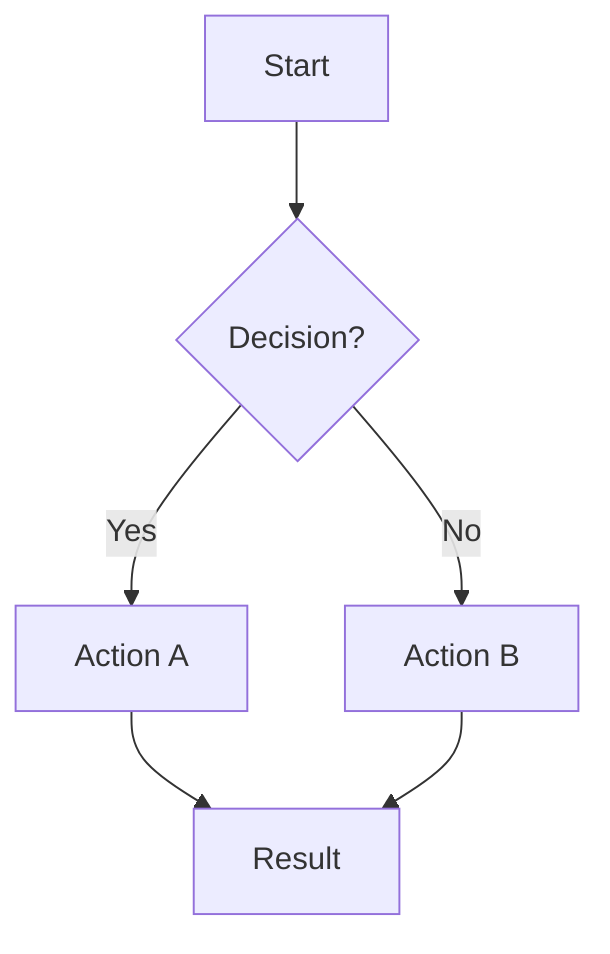
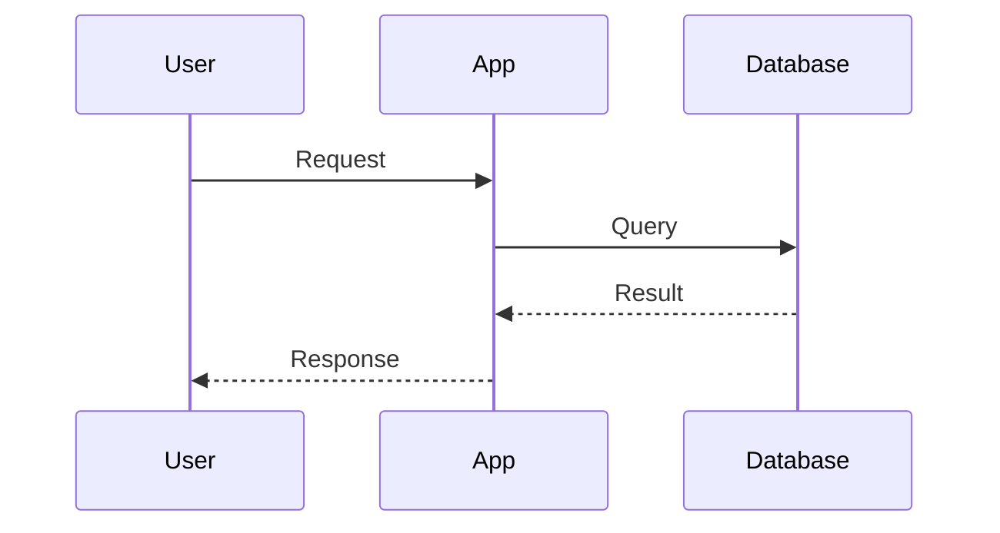
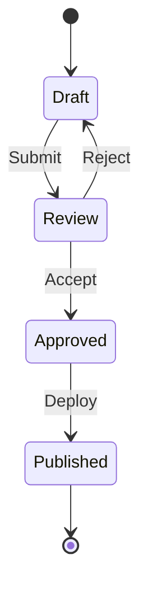
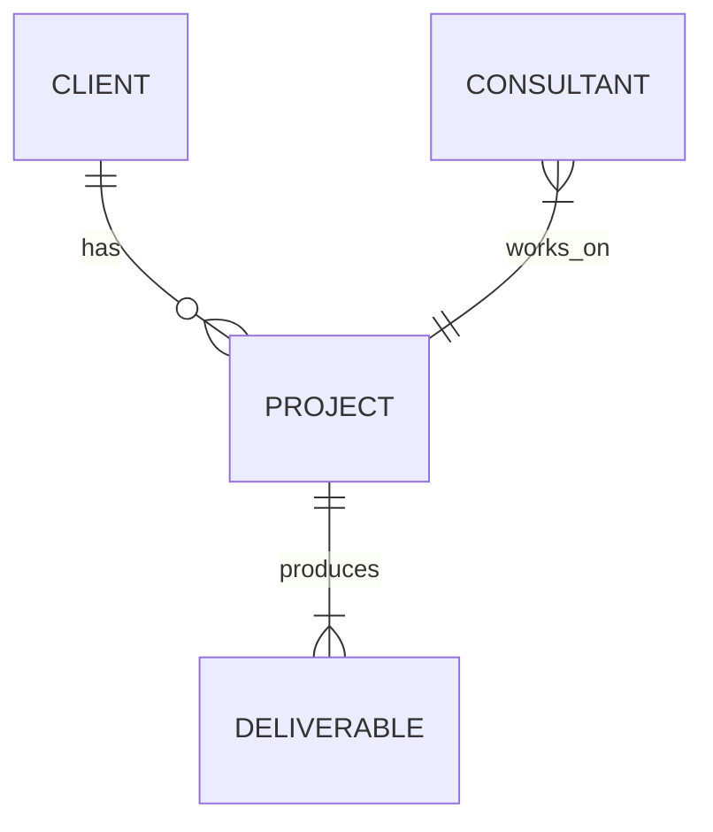
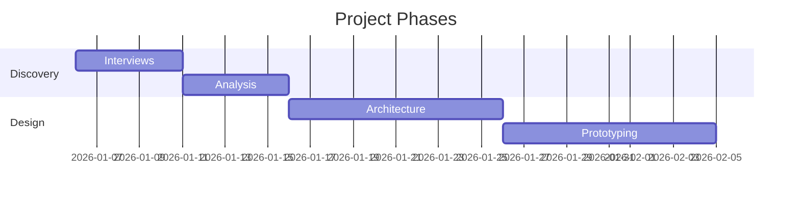
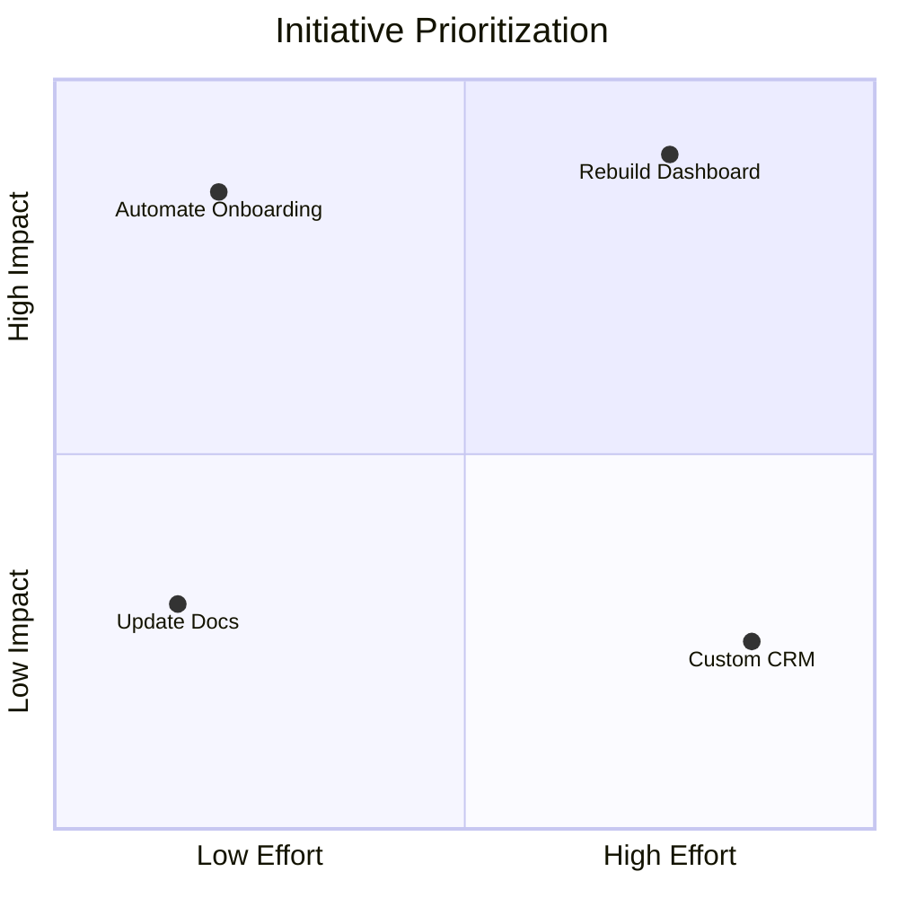
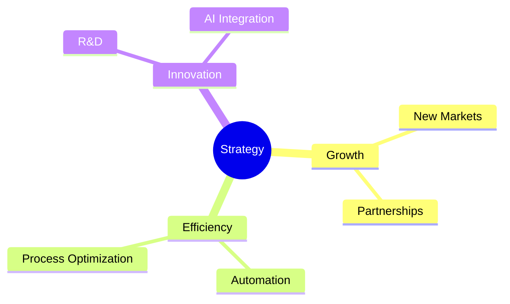
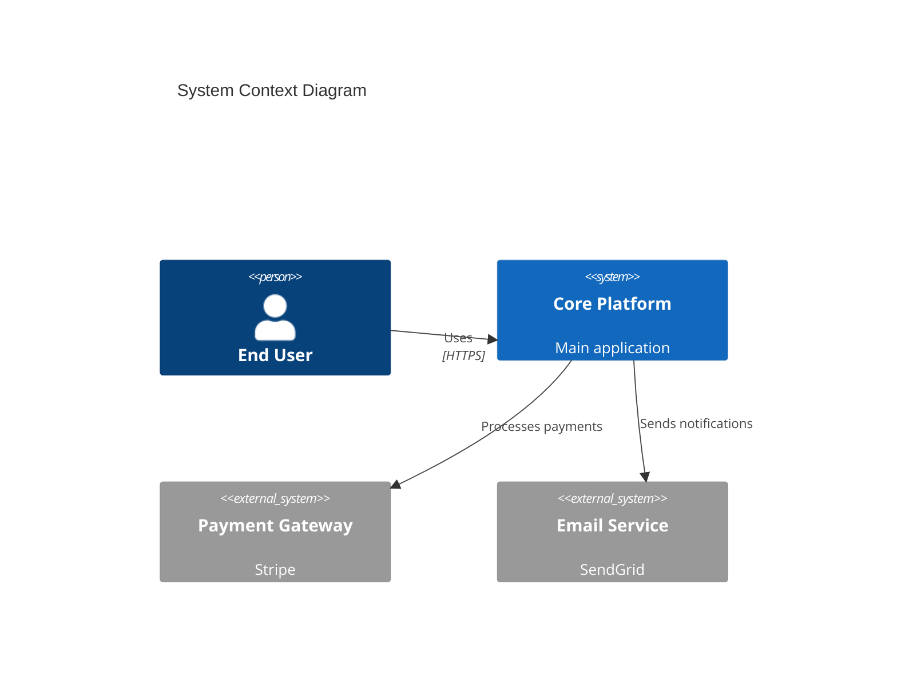

# Mermaid Patterns for Consulting

Quick-reference for common consulting diagram types using Mermaid syntax.

## When to Use Mermaid

- Diagrams embedded in Markdown docs (GitHub, Obsidian, Notion render natively)
- Quick iteration — no external tools needed
- Version-controlled diagrams (text-based diffs)
- Documentation-first workflows

## Supported Diagram Types

### Flowchart (Process, Decision Trees)


### Sequence (API Calls, User Journeys)


### State (Lifecycle, Status Machines)


### Entity-Relationship (Data Models)


### Gantt (Timelines, Roadmaps)


### Quadrant (Prioritization, Effort/Impact)


### Mindmap (Brainstorming, Topic Exploration)


### C4 Context (System Architecture)


## Styling Tips

- Use `classDef` for semantic coloring:
  ```
  classDef highlight fill:#e1f5fe,stroke:#0288d1
  class A,B highlight
  ```
- Keep labels short (max 4-5 words per node)
- Use `:::` for inline classes: `A[Start]:::highlight`
- Vertical (`TD`) for hierarchies, horizontal (`LR`) for processes

## PNG Export

```bash
# Single file
mmdc -i diagram.md -o diagram.png -t dark -b transparent

# With custom width
mmdc -i diagram.md -o diagram.png -w 1200
```
